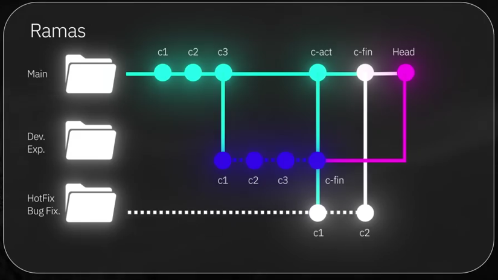

# Gestión de Ramas en Git: Creación, Fusión y Eliminación Eficiente

Una de las características más poderosas y definitorias de Git es su sistema de ramificación (branching). Las ramas permiten trabajar en diferentes características, experimentos o correcciones de errores de forma aislada, sin afectar la línea principal de desarrollo (comúnmente la rama `main`). Aprender a crear, gestionar y fusionar ramas es esencial para optimizar la colaboración y mantener un historial de cambios limpio y organizado.

## 1. ¿Qué son las Ramas y por qué son Útiles?

Imagina una rama como una línea de desarrollo independiente dentro de tu proyecto. Cuando creas una rama, estás creando una copia del estado actual de tu proyecto (de la rama en la que te encuentras) donde puedes hacer cambios sin impactar otras ramas.

Visualmente, las ramas en Git permiten que el desarrollo diverja de la línea principal para trabajar en nuevas funcionalidades o correcciones, para luego, opcionalmente, volver a integrarse. Puedes pensar en ello de la siguiente manera:



**Ventajas Principales de Usar Ramas:**

*   **Aislamiento:** Puedes trabajar en una nueva funcionalidad o corregir un bug en una rama dedicada. Si algo sale mal o decides no continuar con esa tarea, puedes descartar la rama sin afectar la rama principal o el trabajo de otros colaboradores.
*   **Desarrollo Paralelo:** Varios desarrolladores (o tú mismo en diferentes tareas) pueden trabajar en paralelo en distintas ramas.
*   **Experimentación Segura:** ¿Quieres probar una idea loca? Crea una rama. Si funciona, la fusionas; si no, la eliminas.
*   **Organización:** Ayudan a mantener el proyecto organizado, asignando cada tarea o característica a su propia rama.
*   **Flujos de Trabajo Colaborativos:** Son la base de muchos flujos de trabajo populares como Git Flow, permitiendo revisiones de código (Pull Requests) antes de integrar los cambios a la rama principal.

## 2. Comandos Básicos para la Gestión de Ramas

### Verificar la Rama Actual y Listar Ramas: `git branch`

Para saber en qué rama te encuentras actualmente y ver una lista de todas las ramas locales en tu repositorio, ejecuta:
```bash
git branch
```
La rama activa estará marcada con un asterisco (`*`) y generalmente resaltada en un color diferente. Inicialmente, si has seguido las recomendaciones, estarás en la rama `main`.

### Crear una Nueva Rama

Hay dos comandos principales que puedes usar para crear una nueva rama y moverte a ella:

*   **Opción 1 (Clásica): `git checkout -b <nombre-de-la-rama>`**
    Este comando combina dos acciones:
    1.  Crea una nueva rama con el nombre especificado.
    2.  Inmediatamente te cambia (hace "checkout") a esa nueva rama.
    ```bash
    git checkout -b nueva-funcionalidad
    ```
    Después de ejecutar esto, `git branch` mostrará `* nueva-funcionalidad`.

*   **Opción 2 (Moderna): `git switch -c <nombre-de-la-rama>`**
    El comando `git switch` fue introducido para separar las funcionalidades de `git checkout` (que hacía demasiadas cosas). La opción `-c` (de "create") crea la nueva rama y te cambia a ella.
    ```bash
    git switch -c arreglo-bug-123
    ```
    Ambos comandos (`checkout -b` y `switch -c`) logran el mismo resultado. `git switch` es a menudo preferido por su claridad de intención.

    Si solo quieres crear una rama pero **no** moverte a ella inmediatamente, puedes usar:
    ```bash
    git branch <nombre-de-la-rama-sin-cambiar>
    ```

### Cambiar entre Ramas: `git checkout` o `git switch`

Una vez que tienes varias ramas, puedes moverte entre ellas:

*   Usando `git checkout`:
    ```bash
    git checkout main
    git checkout nueva-funcionalidad
    ```

*   Usando `git switch` (sin la opción `-c` porque la rama ya existe):
    ```bash
    git switch main
    git switch nueva-funcionalidad
    ```

## 3. Trabajar en una Rama: Agregar y Confirmar Cambios

Una vez que estás en una rama específica (por ejemplo, `nueva-funcionalidad`), cualquier cambio que realices y confirmes (commits) se registrará solo en esa rama. La rama `main` (u otras ramas) no se verán afectadas hasta que decidas fusionar los cambios.

El flujo de trabajo es el mismo que ya conoces:
1.  Crea o edita archivos en tu proyecto.
2.  Añade los cambios al staging area:
    ```bash
    git add .
    # o git add archivo_especifico.txt
    ```
3.  Confirma los cambios con un mensaje descriptivo:
    ```bash
    git commit -m "Implementada la primera parte de la nueva funcionalidad X"
    ```
Estos commits ahora son parte del historial de la rama `nueva-funcionalidad` y no de `main`.

## 4. Fusionar Cambios (Merging)

Cuando el trabajo en una rama secundaria (ej. `nueva-funcionalidad`) está completo y probado, querrás integrar esos cambios en tu rama principal (ej. `main`). Este proceso se llama "fusión" o "merge".

**Pasos para fusionar `nueva-funcionalidad` en `main`:**

1.  **Asegúrate de que la rama receptora (`main`) esté actualizada** (si trabajas en equipo, podrías hacer un `git pull` aquí).
2.  **Cambia a la rama que recibirá los cambios** (la rama destino, en este caso `main`):
    ```bash
    git switch main
    # o git checkout main
    ```
3.  **Ejecuta el comando `git merge` especificando la rama que quieres fusionar:**
    ```bash
    git merge nueva-funcionalidad
    ```
Git intentará combinar los historiales.
*   **Fast-forward merge:** Si la rama `main` no ha tenido nuevos commits desde que se creó `nueva-funcionalidad`, Git simplemente moverá el puntero de `main` para que apunte al último commit de `nueva-funcionalidad`. Es una fusión "rápida".
*   **Three-way merge (Fusión de tres vías):** Si ambas ramas (`main` y `nueva-funcionalidad`) han tenido commits divergentes, Git creará un nuevo "commit de fusión" (merge commit) que une los dos historiales. Este commit tendrá dos "padres".
*   **Conflictos de Fusión:** Si ambas ramas modificaron la misma parte del mismo archivo de formas diferentes, Git no podrá fusionar automáticamente y se producirá un "conflicto de fusión". Deberás resolver estos conflictos manualmente antes de completar la fusión (esto se verá en detalle más adelante).

Después de una fusión exitosa, los cambios de `nueva-funcionalidad` estarán integrados en `main`.

## 5. Eliminar Ramas

Una vez que una rama ha sido fusionada en la rama principal y ya no es necesaria (especialmente las ramas de características o bugs), es una buena práctica eliminarla para mantener el repositorio limpio y evitar confusiones.

*   Para eliminar una rama local (asegúrate de no estar en la rama que quieres eliminar):
    ```bash
    git branch -d nueva-funcionalidad
    ```
    La opción `-d` (o `--delete`) solo eliminará la rama si sus cambios ya han sido fusionados en otra rama.
*   Si quieres forzar la eliminación de una rama (incluso si tiene cambios no fusionados, ¡úsalo con precaución!):
    ```bash
    git branch -D rama-con-cambios-no-fusionados
    ```

Eliminar ramas que ya cumplieron su propósito ayuda a prevenir el desorden y facilita la navegación por las ramas activas.

---

**Siguiente Tema:** [Git Reset vs Git Revert: Manejo de Historial y Corrección de Errores](05-git-reset-vs-git-revert.md)

**Volver al:** [Índice Principal](../README.md)